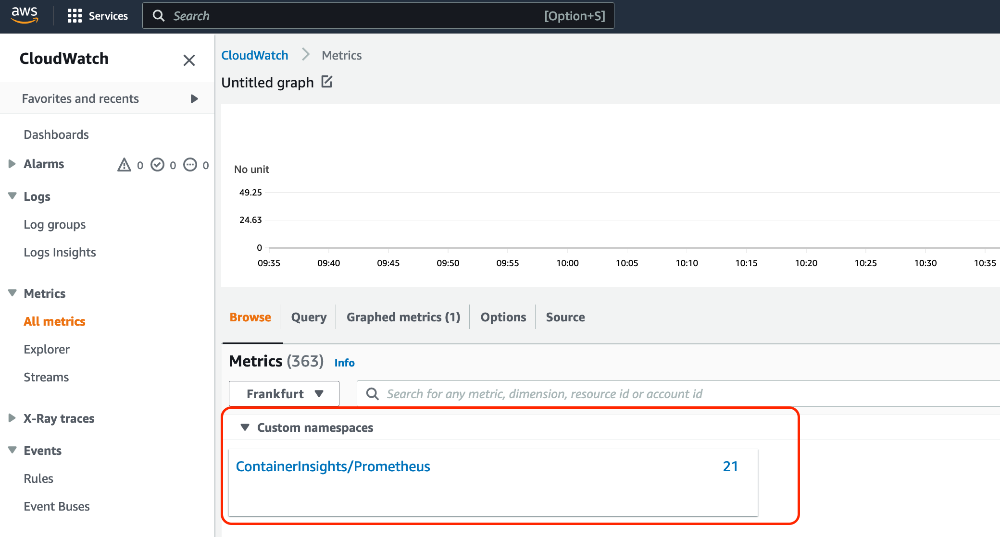

# GPU-metrics-EKS-Cloudwatch
The demand for GPU instances is increasing due to their use in various Machine Learning applications such as neural network training, complex simulations, and other related tasks. However, this demand presents challenges for customers, such as cost optimization and increased efficiency, as well as the need to allocate GPU usage costs among different parties on a platform solution. To address these challenges, specific data is necessary, and this blog post aims to provide guidance on how to collect this data.

The main focus of this blog post is to obtain utilization metrics at the container, pod, or namespace level. We will provide details on how to set up container-based GPU metrics and demonstrate how it is integrated into Amazon Elastic Kubernetes Service (EKS) using CloudWatch as an example.

## Solution Overview
In summary, our approach involves creating an Amazon Elastic Kubernetes Service (EKS) cluster using a G4.2xlarge instance, although it can be applied to any NVIDIA-accelerated instance family. We will deploy NVIDIA Data Center GPU Manager (DCGM) exporter, which exposes GPU metrics at an HTTP endpoint for monitoring solutions like CloudWatch. We will then use the Prometheus EKS deployment specification to collect the metrics and push them to Amazon CloudWatch Metrics. These metrics provide developers with data to identify optimization opportunities for their workloads. Moreover, we will demonstrate how the collected metrics can be used to allocate costs internally in platform setups where different teams run their workloads on the platform. <br>

Alternatively, the collected metrics can be sent to Prometheus and viewed using Grafana. For this purpose, Nvidia offers [Grafana dashboards](https://grafana.com/grafana/dashboards/12239-nvidia-dcgm-exporter-dashboard/) to visualize metrics from the DCGM exporter. Although this blog post will focus on sending the metrics to CloudWatch and viewing them in a CloudWatch dashboard, it is important to consider [Metrics Insights limits](https://docs.aws.amazon.com/AmazonCloudWatch/latest/monitoring/cloudwatch-metrics-insights-limits.html). However, the DCGM exporter setup and the Prometheus scrape configuration described in this blog post can be reused for other monitoring solutions. For those interested in setting up Prometheus as part of an EKS cluster, this [documentation](https://docs.aws.amazon.com/eks/latest/userguide/prometheus.html) provides a starting point.

## NVIDIA GPU DRIVERS
There are various methods to set up and configure the GPU nodes in your EKS cluster. The deployment of the DCGM Exporter depends on your specific setup. If you use the [Amazon EKS optimized accelerated Amazon Linux AMIs](https://docs.aws.amazon.com/eks/latest/userguide/eks-optimized-ami.html) provided by Amazon, the NVIDIA drivers are already included in the machine image. In this case, you need to install the [NVIDIA device plugin for Kubernetes](https://github.com/NVIDIA/k8s-device-plugin), and then deploy the [DCGM Exporter](https://github.com/NVIDIA/dcgm-exporter) as an additional component into the cluster.

NVIDIA recommends deploying the DCGM Exporter as part of the [GPU Operator](https://docs.nvidia.com/datacenter/cloud-native/gpu-operator/overview.html) instead of manual deployment. The GPU Operator simplifies node setup by including various components, such as the NVIDIA device plugin for Kubernetes, to configure the nodes. NVIDIA provides details on how these components fit together in a blog post titled [NVIDIA GPU Operator: Simplifying GPU Management in Kubernetes](https://developer.nvidia.com/blog/nvidia-gpu-operator-simplifying-gpu-management-in-kubernetes/).

However, in this blog post, we will use the "Amazon EKS optimized accelerated Amazon Linux AMIs" and deploy the DCGM exporter as a separate component without using the GPU Operator. This is because the optimized AMI already includes the components that the GPU Operator would otherwise deploy.

## Prerequisite 
In order to deploy the entire stack you will need the AWS command line utility, helm, eksctl, and kubectl. You also need an EKS cluster with GPU nodes.

## Deploy
1. Attach the CloudWatchFullAccess policy to the IAM role of the Nodes to authorize them to deploy metrics.

2. Install the NVIDIA Helm Repo
```bash
helm repo add gpu-helm-charts-2 \
  https://nvidia.github.io/dcgm-exporter/helm-charts && helm repo update
```

** Make sure that you add the repo gpu-helm-charts-2. Helm charts for the dcgm exporter are no longer updated in the repo gpu-helm-charts. The dcgm exporter version used in the latest helm chart version of the gpu-helm-charts repo is 2.2.9-2.4.0. The version of the dcgm-exporter in gpu-helm-charts-2 chart version 3.1.3 is 3.1.6-3.1.3.

Install the Prometheus Operator Dependency on ServiceMonitor for in version "monitoring.coreos.com/v1“ 

3. Create the DCGM export Config Map and install the DCGM exporter.
```bash
curl https://raw.githubusercontent.com/NVIDIA/dcgm-exporter/main/etc/dcp-metrics-included.csv > dcgm-metrics.csv && \
kubectl create namespace dcgm-exporter && \
kubectl create configmap metrics-config -n dcgm-exporter --from-file=dcgm-metrics.csv
```
You have the option to edit the dcgm-metrics.csv file if you want add/remove any metrics to be collected by the dcgm exporter. However, we will do a selection of metrics later as part of the CloudWatch logs upload.

4. Apply the DCGM export to the EKS cluster
```bash
helm install --wait --generate-name -n dcgm-exporter --version 3.1.3 --create-namespace gpu-helm-charts-2/dcgm-exporter \
--set config.name=metrics-config \
--set env[0].name=DCGM_EXPORTER_COLLECTORS \
--set env[0].value=/etc/dcgm-exporter/dcgm-metrics.csv
```
Confirm that the DCGM exporter pod is running - if you inspect the logs the webserver should be up and running.
```bash
time="2022-08-24T19:32:11Z" level=info msg="Starting webserver"
amrraga@3c22fbbb46bb ~ % kubectl logs nvidia-dcgm-exporter-g2xfp -n gpu-operator
Defaulted container "nvidia-dcgm-exporter" out of: nvidia-dcgm-exporter, toolkit-validation (init)
time="2022-08-24T19:32:11Z" level=info msg="Starting dcgm-exporter"
time="2022-08-24T19:32:11Z" level=info msg="DCGM successfully initialized!"
time="2022-08-24T19:32:11Z" level=info msg="Collecting DCP Metrics"
time="2022-08-24T19:32:11Z" level=info msg="No configmap data specified, falling back to metric file /etc/dcgm-exporter/dcgm-metrics.csv"
time="2022-08-24T19:32:11Z" level=info msg="Kubernetes metrics collection enabled!"
time="2022-08-24T19:32:11Z" level=info msg="Pipeline starting"
```
You can test that the DCGM exporter is working by forwarding the port locally to your developer machine like this:
```bash
kubectl port-forward -n dcgm-exporter <pod-name> 9500:9400
```
You can then view the metrics by opening http://localhost:9500/metrics in your Browser. It should like this:

5. Create Cloudwatch Agent configuration to scrape the metrics and upload them to CloudWatch
```bash
# Download an example configuration:
curl -O https://raw.githubusercontent.com/aws-samples/amazon-cloudwatch-container-insights/latest/k8s-deployment-manifest-templates/deployment-mode/service/cwagent-prometheus/prometheus-eks.yaml
```
For the cwagent.json metrics declaration add the following for cwagent.json configuration file
This configuration file only captures GPU utilization as well as main memory usage and power usage. If you want to add additional metrics, you can review a list of field identifiers in the [NVIDIA dcgm documentation](https://docs.nvidia.com/datacenter/dcgm/3.1/dcgm-api/dcgm-api-field-ids.html).

The pod_name as part of the cw-agent configration represents the value provided by the K8s metadata hence will always be equivalent with the name of the dcgm export pod. The value of pod is the value scraped from the dcgm-exporter, the real value we are interested in and which we will forward to Cloudwatch metrics. 
In the ConfigMap for the Prometheus configuration add a section for the dcgm exporter.
```bash
- job_name: 'kubernetes-pod-dcgm-exporter'
      sample_limit: 10000
      kubernetes_sd_configs:
      - role: endpoints
      relabel_configs:
      - source_labels: [__meta_kubernetes_pod_container_name]
        action: keep
        regex: '^exporter.*$'
      - source_labels: [__address__]
        action: replace
        regex: ([^:]+)(?::\d+)?
        replacement: ${1}:9400
        target_label: __address__
      - action: labelmap
        regex: __meta_kubernetes_pod_label_(.+)
      - action: replace
        source_labels:
        - __meta_kubernetes_namespace
        target_label: Namespace
      - source_labels: [__meta_kubernetes_pod_name]
        action: replace
        target_label: pod_name
      - action: replace
        source_labels:
        - __meta_kubernetes_pod_container_name
        target_label: container_name
      - action: replace
        source_labels:
        - __meta_kubernetes_pod_controller_name
        target_label: pod_controller_name
      - action: replace
        source_labels:
        - __meta_kubernetes_pod_controller_kind
        target_label: pod_controller_kind
      - action: replace
        source_labels:
        - __meta_kubernetes_pod_phase
        target_label: pod_phase
      - action: replace
        source_labels:
        - __meta_kubernetes_pod_node_name
        target_label: NodeName
```
The regex for __meta_kubernetes_pod_container_name matches with the container name inside of the DCGM Pod as part of the service discovery mechanism within Prometheus. 
Please consider that this configuration is intended to show the implementation of the GPU metric collection hence only includes collection of these and no other metrics. 
If you have already setup the CloudWatch Agent you can also integrate the configuration from the provided configuration into your own configuration.

6. Deploy the YAML from step 5.
```bash
kubectl apply -f prometheus-eks.yaml 

```
Confirm that cloudwatch agent - prometheus pod is running
```bash
NAMESPACE         NAME                                READY STATUS  RESTARTS AGE
amazon-cloudwatch cwagent-prometheus-56c448885d-v2k9l 1/1   Running 
```

7. Confirm Metrics in the Cloudwatch Console.
Navigate to the AWS Cloudwatch Console. Go to All Metrics and in the custom namespaces you should see a new entry for ContainerInsights/Prometheus. If you graph the metrics then you should see per the metrics per container metrics captured via DCGM.



## Example Dasboards
Inside of Cloudwatch you can create Dashboards helping you to identify optimization potential for your containers:

In the example Dashboard above you can see overall GPU utilization for your cluster in the left top corner. In the right top corner, you can see the GPU utilization for every GPU grouped by Instance & GPU. In the middle graph is the GPU utilization per Pod which shows that the Pod with the name dcgmproftester2 has a low GPU utilization. In this specific case, the Pod has requested two GPUs but is only using one, blocking the second GPU for other workloads without using it. 